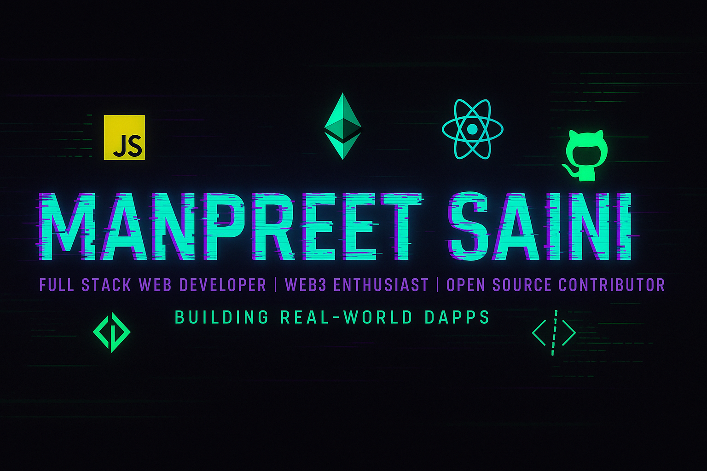

  

<!-- 🔠 Typing Effect -->

  

## 🧠 About Me

Hey there! 👋 I'm **Manpreet Saini**, a passionate **Full-Stack Developer** who loves turning ideas into real-world applications.  
I work with modern web technologies like **React**, **Next.js**, **Node.js**, and even dive into **Web3** with **Solidity**.

- 🔭 I’m currently building cool side-projects and dApps  
- 🌱 Exploring the world of decentralized tech & smart contracts  
- 🛠️ I love minimal UI, dark mode, and pixel-perfect frontend  
- ☕ Fuelled by coffee, creativity, and clean code  
- 💬 Always open for collaborations, ideas, or just a good developer meme

---

## 🚀 Tech Stack

  

---

## 📊 GitHub Stats

  
  

---

## 📈 Top Languages

  

---

## 💎 Featured Projects

- 🐞 [Bug Tracker](https://github.com/sainimanpreet/bug-tracker) – Minimal Issue Management System  
- 🗺️ [Wanderlust](https://github.com/sainimanpreet/major-project) – Listing & Review Web App  
- 🔥 More Projects coming soon...

---

## 🔗 Connect With Me

  
  
  

---

## ✍️ Quote of the Day

  

---

  

